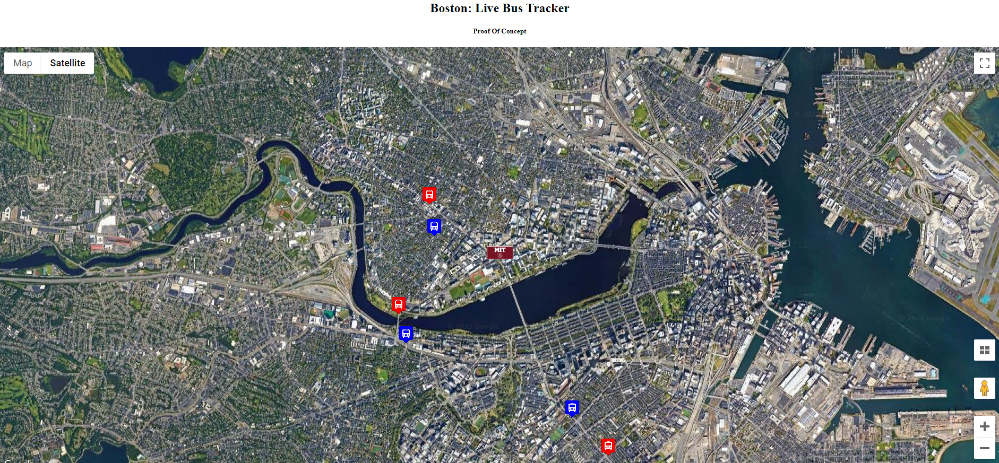

# BostonBusTracker

<!--Expanded upon by Philip Case based on an MIT XPro class exercise June 2022-->

<h2>How to Run</h2>

1. Open index.html file in web browser
2. Watch the annimation of the bus icons move as they drive down Boston streets in real time
3. Color of bus icon represents the directional route movement of the bus

<h2>Roadmap Run:</h2>

1. Add mouse hover popup information about available seats
2. Create user selection of specific bus route

<h2>Data Sources</h2>
1. Google Maps API (under Free Public License)
2. Massachusetts BayTransportation Authority using V3 API 

<h2> Challenges</h2>

<h2>License Discolures:</h2>
1. MIT License

